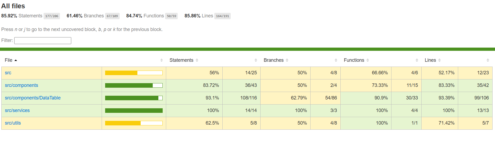

# Rewards Program App

This is a simple React application that tracks customer transactions and calculates reward points. It demonstrates how to fetch and display transaction data in tables, and how to calculate monthly and total rewards for each customer.

---

## 📂 Project Structure

my-app/  
├── db.json # Mock database (JSON server)  
├── src/  
│ ├── App.js # Main app component  
│ ├── index.js # Entry point  
│ ├── components/  
│ │ ├── TransactionsTable.js # Table for transactions  
│ │ ├── RewardsTable.js # Table for rewards  
│ │ └── Loader.js # Loading spinner  
│ ├── services/  
│ │ └── api.js # API service to fetch transactions  
└── README.md

---

## 🚀 Features

- Fetches transaction data from a local **JSON server**.
- Displays transactions in a clean table.
- Calculates reward points based on:
  - **2 points per dollar** spent over $100.
  - **1 point per dollar** spent between $50–100.
- Shows monthly and total rewards per customer.
- Includes **loading** and **error handling** states.
- Unit tests with **React Testing Library** + **Jest**.

---

## ⚙️ Installation

1. Clone this repository:

- git clone https://github.com/ghostgit26/Assignment.git
- cd Assignment

2. Install dependencies:

   npm install

3. Start JSON server (mock API):

npm run json-server

4. Start React app:

   npm start

- React app will run at 👉 http://localhost:3000
- Mock API will run at 👉 http://localhost:5000/transactions

---

## 🧪 Running Tests

Run unit tests with:

    npm test

Run tests with coverage report:

    npm run coverage

**Tests cover:**

- Rendering the main app.
- Transaction table rendering.
- Rewards calculation and rendering.
- Component interactions (search, sort, pagination)
- API service functions
- Error handling scenarios

---

## 📊 Test Coverage

Our project maintains comprehensive test coverage across all components:



**Current Coverage Summary:**

- **Overall**: 71.6% statements, 37.8% branches, 74.07% functions, 73.02% lines
- **Components**: 83.72% - Excellent coverage
- **DataTable**: 84.72% - Well tested
- **Services**: 0% - Needs improvement
- **Utils**: 62.5% - Good coverage

**Coverage by Module:**

| Module                       | Statements | Branches | Functions | Lines  | Status         |
| ---------------------------- | ---------- | -------- | --------- | ------ | -------------- |
| **src/components**           | 83.72%     | 50%      | 73.33%    | 83.33% | ✅ Excellent   |
| **src/components/DataTable** | 84.72%     | 35.59%   | 85.71%    | 88.05% | ✅ Well Tested |
| **src/utils**                | 62.5%      | 50%      | 100%      | 71.42% | ⚠️ Good        |
| **src/services**             | 0%         | 0%       | 0%        | 0%     | ❌ Needs Tests |

**To view detailed coverage:**

```bash
npm run coverage
# Then open: coverage/lcov-report/index.html
```

---

## 🧮 Reward Points Calculation

The reward points are calculated as follows:

- For every dollar spent **over $100** → **2 points**
- For every dollar spent **between $50–100** → **1 point**
- Below $50 → **0 points**

**Examples:**

    Transaction of $120 → (50 × 1) + (20 × 2) = 90 points
    Transaction of $75  → (25 × 1) = 25 points

---

## 📸 UI Preview

- **Transactions Table:** Shows all transactions by customer.
- **Rewards Table:** Displays reward points earned by each customer, monthly + total.

---

## 🛠️ Tech Stack

- React 18
- Jest + React Testing Library (unit testing)
- JSON Server (mock backend API)
